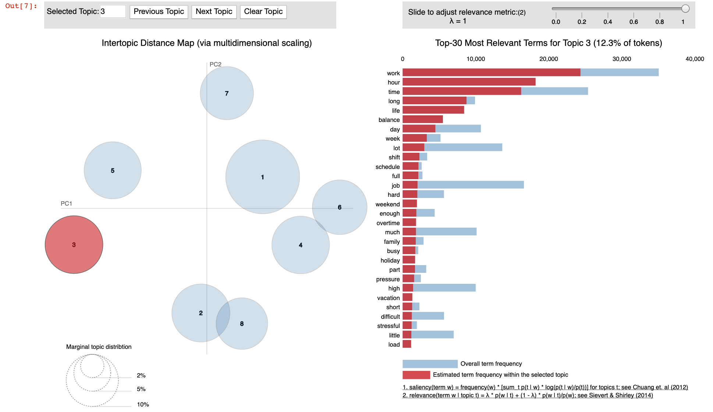

# Glassdoor Review (ongoing project)

### Scripts and notebooks
* script: read_large_dta.py: reads the original 16GB STATA data file, and randomly select a representative subsample to conduct text analysis
* script: data_preprocessing.py: pre-process reviews on company pros and cons by: removing stop words + lemmatization
* script: LDA_ntopics.py: trying LDA model with different number of topics and plot the coherence scores to find optimal number of topics to set for LDA model; trained LDA models with optimal number of topics
* notebook: LDA_visualization.ipynb: visualized the topics found by LDA using pyLDAvis
* script: label_topics.py: label topics to reviews using trained LDA model

### Topic visualization
The screenshot below exhibits a visualization of a topic found by the LDA model of all the employee reviews about cons.  

  